# PAYMENT_DOCUMENTATION.md

**Tapes For You — HDFC SmartGateway Payment Integration Design**
*Design document only — no code, no schema execution, no API implementation. Extends the existing architecture; nothing existing is renamed, removed, or broken.*

> **Source-of-truth discipline**: every HDFC-specific claim in this document (endpoints, headers, status values, webhook behavior, idempotency mechanism) is taken only from the official HDFC SmartGateway documentation pages actually reviewed in this project (see `HDFC-SmartGateway-Documentation-Verification.md` in this same folder for the verbatim extraction). Anywhere this document goes beyond what was confirmed in those pages (e.g. Chargeback/Dispute handling, Settlement data, the exact `/session` request schema), it is explicitly marked **"Not confirmed from reviewed HDFC docs — verify before building."** Nothing about HDFC is invented.

---

## Table of Contents

1. [Existing Project Analysis](#part-1--existing-project-analysis)
2. [Payment System Design](#part-2--payment-system-design)
3. [UML Diagrams](#part-3--uml-diagrams)
4. [ER Diagram](#part-4--er-diagram)
5. [Database Schema](#part-5--database-schema)
6. [Payment Endpoints](#part-6--payment-endpoints)
7. [Payment Business Logic](#part-7--payment-business-logic)
8. [Payment Status Flow](#part-8--payment-status-flow)
9. [Webhook Design](#part-9--webhook-design)
10. [Security](#part-10--security)
11. [Folder Structure](#part-11--folder-structure)
12. [This Document](#part-12--this-document)

---

## PART 1 — Existing Project Analysis

### Current Checkout Flow
Cart (guest or logged-in, `Cart`/`CartItem`) → `POST /orders` → `OrderService.createOrder()` runs inside **one Sequelize transaction**: validates stock, applies a coupon (`Coupon.used_count` incremented), calls `ShippingService.calculateShipping()` (real Bigship distance-based rate, with a documented free-shipping-under-₹899 zone rule), computes GST (`taxableAmount = subtotal + shipping`, 18%), creates `Order` + `OrderItem` rows, decrements `ProductVariant.stock_qty`, clears the cart, generates the invoice PDF (`InvoiceService`).

### Current Order Flow
`Order.status` ENUM: `pending → confirmed → processing → shipped → delivered`, plus `cancelled | returned | refunded`. An order is created `pending` regardless of payment method. It reaches `confirmed` either automatically (Razorpay payment verified) or manually (admin moves the status dropdown — the COD path, since COD has no auto-confirm step).

**As of 2026-07-24, reaching `confirmed` also auto-books a real Bigship shipment** (`OrderService.autoBookShipmentIfNeeded`) — relevant to this design because payment confirmation is now the trigger for a downstream, real-money shipping action too, not just an internal status flip. This payment design must not disturb that trigger.

### Current Payment Flow
`OrderController.createOrder` → if `paymentMethod !== 'cod'` → `RazorpayService.createOrder(order.total, order.id)` creates a `Payment` row (`status: pending`) + a Razorpay order. Customer completes payment on Razorpay's hosted checkout. `POST /orders/verify-payment` → `RazorpayService.capturePayment()` → HMAC-SHA256 signature check → `Payment.status`/`Order.payment_status`/`Order.status` updated, then auto-book-shipment fires.

**No webhook exists today** — verification is entirely client-driven (`POST /orders/verify-payment` called by the browser after checkout). This is the single biggest gap this design must close for HDFC, since HDFC's own documentation makes server-to-server verification **mandatory**, not optional (see `HDFC-SmartGateway-Documentation-Verification.md`).

### Existing Database Schema (payment-relevant tables only)
- **`orders`** — `id, order_number, user_id, address_id, coupon_id, subtotal, discount_amount, coupon_discount, shipping_charge, gst_amount, total, status (ENUM), payment_status (ENUM: pending|paid|failed|refunded|partially_refunded), payment_method (ENUM: razorpay|cod|upi|bank_transfer), notes, cancelled_at, cancel_reason, delivered_at, is_b2b, traffic_source`
- **`payments`** — `id, order_id, razorpay_order_id, razorpay_payment_id, razorpay_signature, amount, currency, method, status (ENUM), gateway_response (JSONB), refund_id, refund_amount, refunded_at`. `Order.hasOne(Payment, { as: 'payment' })`.
- **`activity_logs`** — generic audit trail (actor, action, model, model_id, old/new values, IP, browser/OS/device, snapshot JSONB) — already used for `ORDER_PAYMENT_RECEIVED`/`ORDER_REFUNDED` actions.
- **`notifications`** — admin in-app alert bell (`user_id: null` rows for admin-facing events).

### Existing APIs (payment-relevant)
| Method | Path | Auth |
|---|---|---|
| POST | `/orders` | user |
| POST | `/orders/verify-payment` | user |
| PUT | `/admin/orders/:id/mark-paid` | admin (COD only) |
| PUT | `/admin/orders/:id/status` | admin |
| GET | `/admin/orders/:id/credit-note` | admin |

### Existing Models
`Order`, `OrderItem`, `Payment`, `Shipment`, `Invoice`, `Coupon`, `Address`, `User`, `ActivityLog`, `Notification` — all under `src/models/`, associated via `src/models/index.js`.

### Existing Services
`OrderService` (order lifecycle + now shipment auto-booking), `RazorpayService` (the only existing payment gateway service — this design's structural template), `ShippingService`/`BigshipService`, `EmailService`, `InvoiceService`, `NotificationService`, `ActivityLogService`.

### Existing Controllers
`OrderController` (thin HTTP layer — `createOrder`, `verifyPayment`, `myOrders`, `myOrderDetail`, `cancelOrder`, plus `admin*` methods). **Architecture Principle already established in this codebase**: controllers are thin, services own business logic, repositories own DB queries — this design follows the same three-layer split.

### Existing Routes
`routes/order.routes.js` (`router.use(protect)` — all order routes require login; no separate `payment.routes.js` exists yet).

### Existing Middleware
`middlewares/auth.js` (`protect`, `adminProtect`, `superAdmin`, `optionalAuth` — separate JWT systems for customers vs admins, same `JWT_SECRET`, different `type` claim), `validate.js` (Joi schema middleware), `errorHandler.js` (masks any 5xx to a generic "Internal server error" — **critical**: any thrown error must carry an explicit `err.statusCode` for a real reason to reach the client, exactly as `ShippingService`/`OrderService` already do), `rateLimiter.js` (`general`, `auth`, `strict`, `publicCatalog`), `csrf.js` (double-submit cookie, scoped only to `/auth/refresh` today).

### Existing Webhook Implementation
**None.** Confirmed via a full-codebase review — no webhook route exists anywhere in this backend (Bigship has no webhooks either; Razorpay's webhook was never built). This design introduces the **first** webhook endpoint this project will have.

### Existing Environment Variables (payment-relevant)
```env
RAZORPAY_KEY_ID=
RAZORPAY_SECRET=
```
No `HDFC_*` variables exist yet.

---

## PART 2 — Payment System Design

### High-Level Architecture

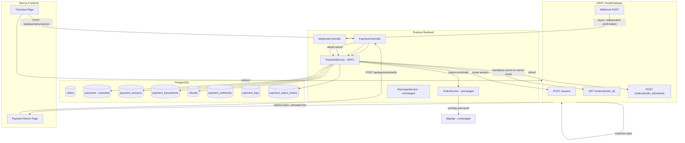

### Low-Level Architecture (layering, matches existing Architecture Principles)

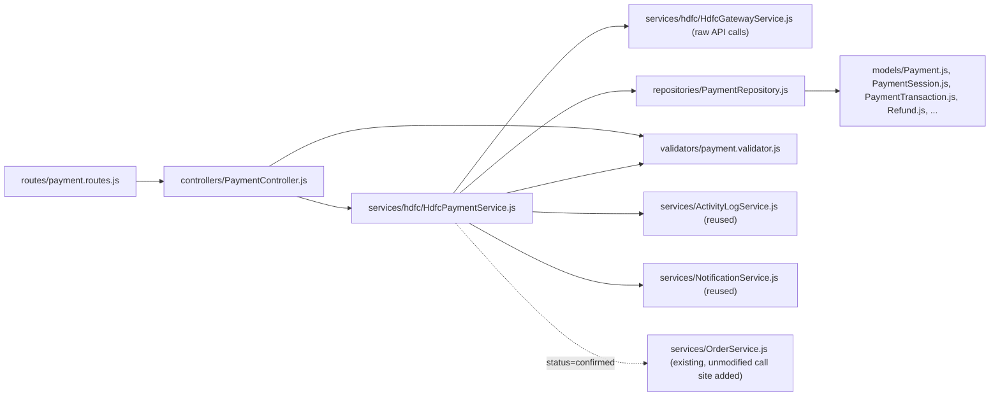

### Payment Component Architecture

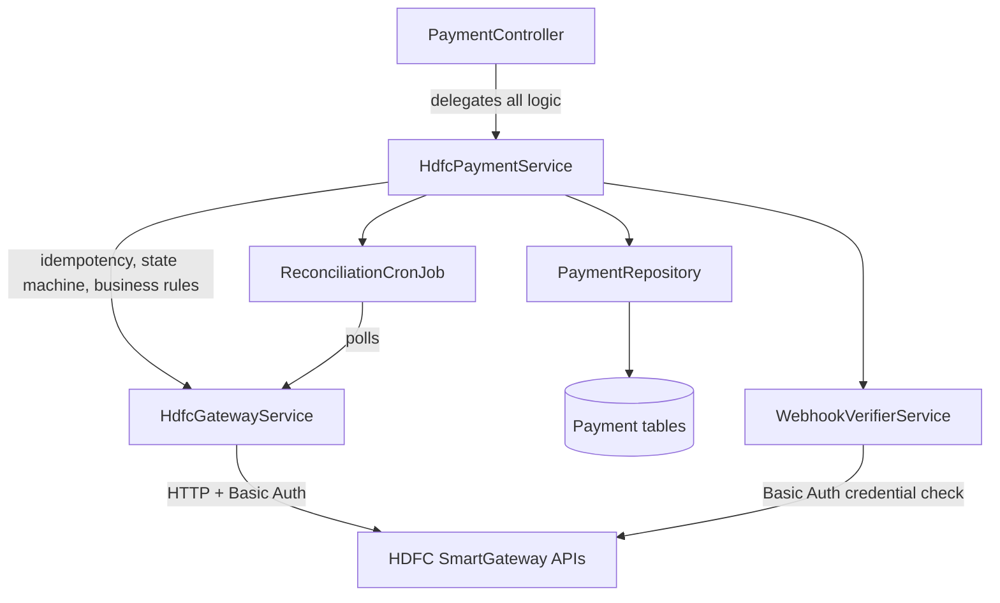

### Payment Request Flow

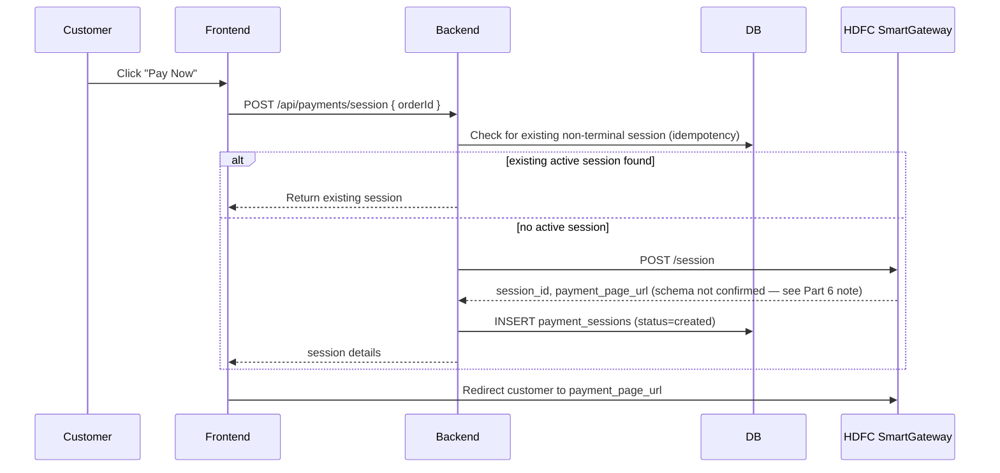

### Payment Response Flow

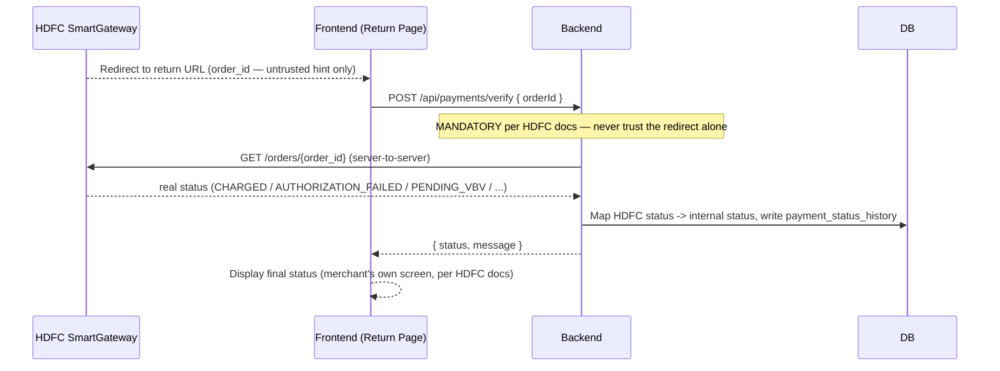

### Payment Verification Flow

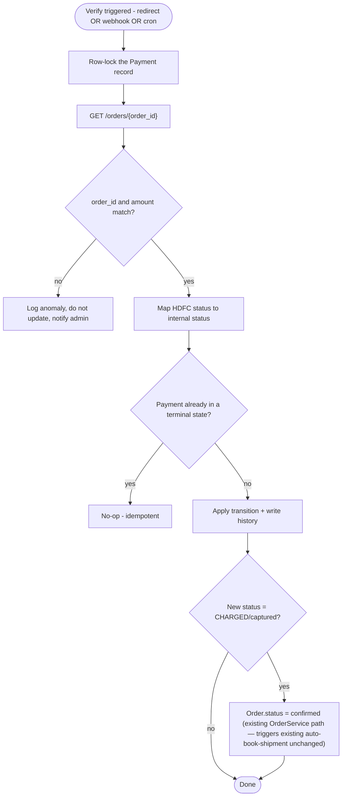

### Webhook Flow

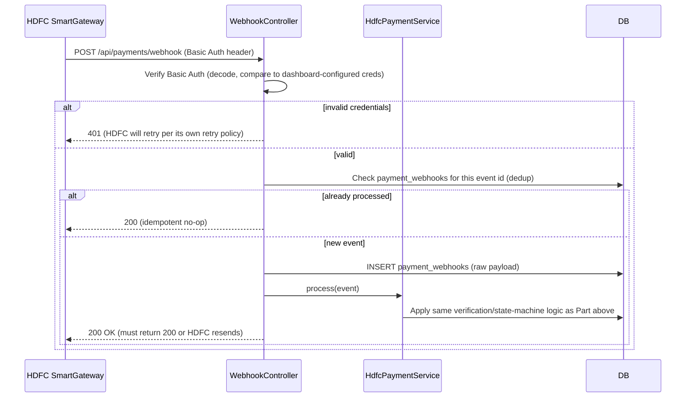

### Payment Retry Flow

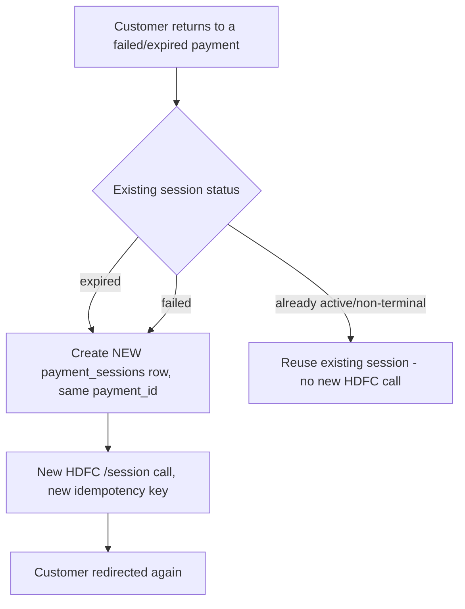

### Refund Flow

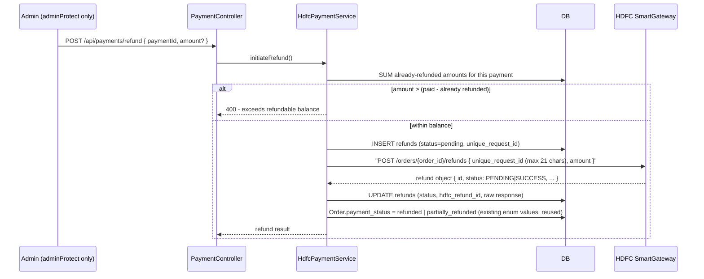

### Failed Payment Flow

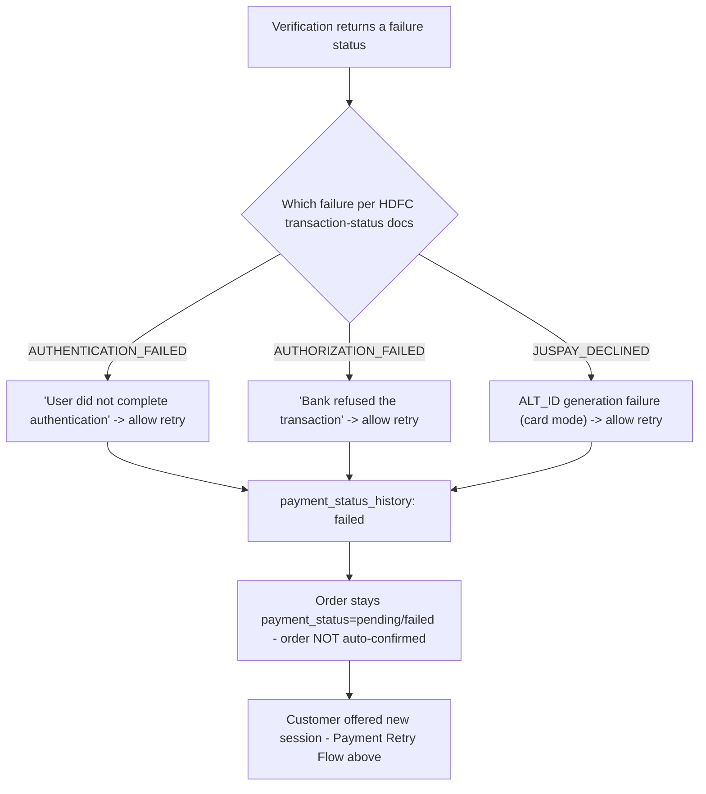

### Payment Status Update Flow

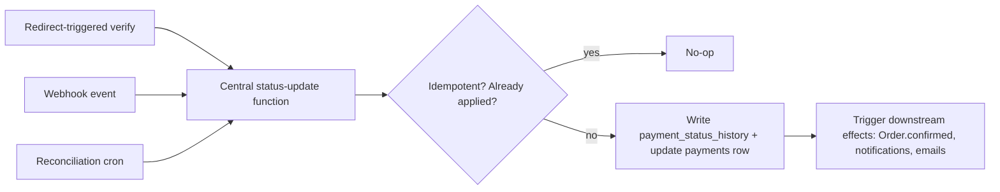

---

## PART 3 — UML Diagrams

### 1. Use Case Diagram

```mermaid
flowchart TB
    Customer((Customer))
    Admin((Admin))
    Gateway((Payment Gateway))
    Webhook((Webhook))
    System((System))

    Customer --> UC1[Initiate Payment]
    Customer --> UC2[Retry Failed Payment]
    Customer --> UC3[View Payment History]
    Customer --> UC4[View Order Timeline]

    Admin --> UC5[View Payment Dashboard]
    Admin --> UC6[Initiate Refund]
    Admin --> UC7[View Refund Dashboard]
    Admin --> UC8[Retry Failed Verification]
    Admin --> UC9[View Payment Audit Logs]

    Gateway --> UC10[Create Session]
    Gateway --> UC11[Process Payment]
    Gateway --> UC12[Return Order Status]
    Gateway --> UC13[Process Refund]

    Webhook --> UC14[Send Payment Event]
    Webhook --> UC15[Send Refund Event]

    System --> UC16[Verify Payment Server-to-Server]
    System --> UC17[Reconcile Stuck Payments - cron]
    System --> UC18[Auto-confirm Order]
    System --> UC19[Log Every API Call]
```

### 2. Sequence Diagram — Full Checkout-to-Fulfillment

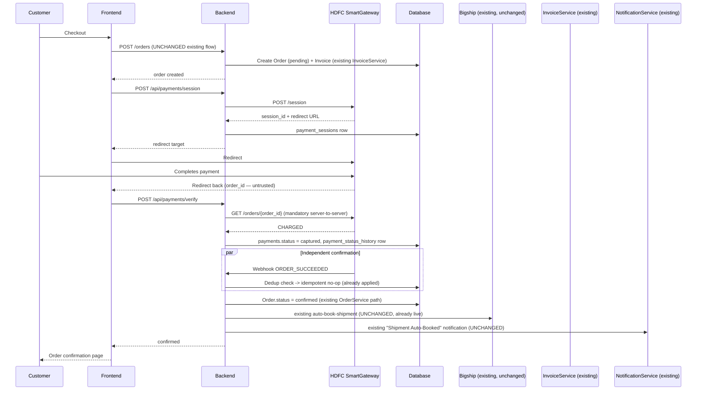

### 3. Activity Diagram — Payment Lifecycle

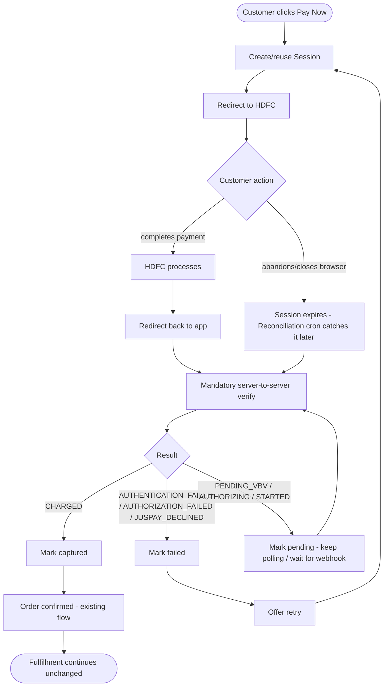

### 4. State Diagram — Payment Status

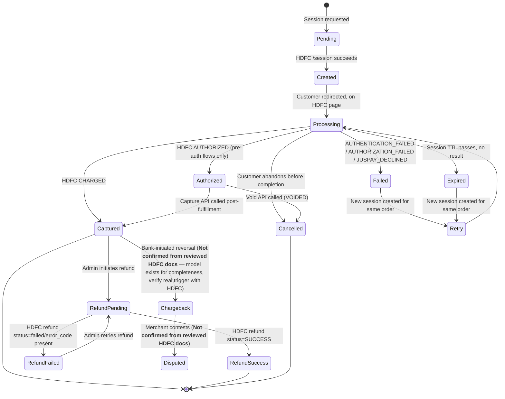

> **Honesty note on this diagram**: `Pending, Created, Processing, Authorized, Captured, Failed, Cancelled, Expired` map directly onto HDFC's real, documented `NEW/PENDING_VBV/AUTHORIZING/STARTED/AUTHORIZED/CHARGED/AUTHENTICATION_FAILED/AUTHORIZATION_FAILED/JUSPAY_DECLINED/VOIDED` values. `RefundPending/RefundSuccess/RefundFailed` map onto the real Refund API's documented `PENDING`/`SUCCESS`/error-code response. **`Chargeback` and `Disputed` were not found anywhere in the HDFC documentation pages reviewed for this project** — they are included because they're standard payment-domain concepts and a production system should have a home for them, but the *actual* HDFC mechanism that would populate them (a separate chargeback API/webhook) must be confirmed with HDFC directly before relying on this part of the state machine.

### 5. Component Diagram

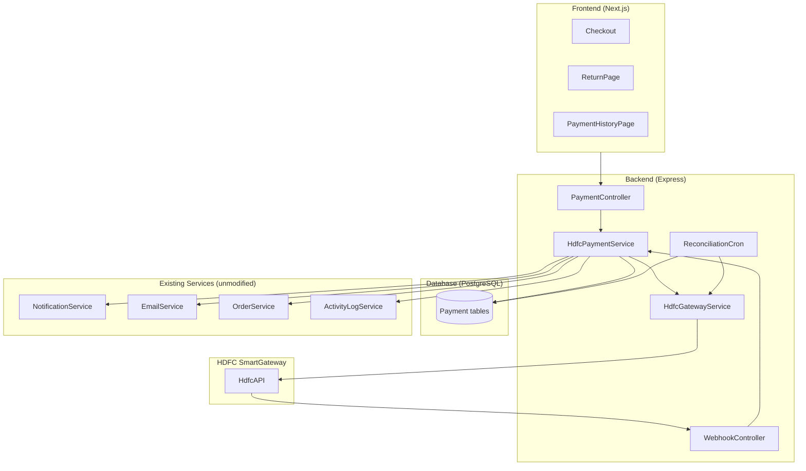

---

## PART 4 — ER Diagram

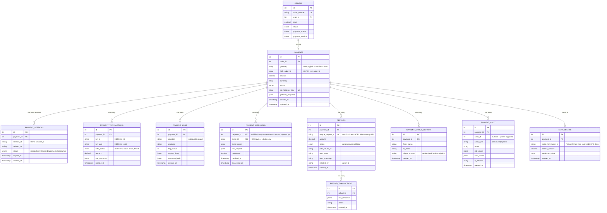

**Indexes** (beyond primary/foreign keys):
- `payments`: unique index on `idempotency_key`; index on `order_id`; index on `hdfc_order_id`.
- `payment_sessions`: index on `(payment_id, status)` for the "find existing active session" idempotency check.
- `payment_webhooks`: **unique** index on `event_id` — this is the actual dedup mechanism, not optional.
- `refunds`: unique index on `unique_request_id` (mirrors HDFC's own uniqueness rule).
- `payment_status_history`: index on `(payment_id, created_at)` for timeline queries.

**Cascade rules**: all child tables (`payment_sessions`, `payment_transactions`, `payment_logs`, `payment_webhooks` where resolved, `refunds`, `payment_status_history`, `payment_audit`) use `ON DELETE RESTRICT` on `payment_id` — a `Payment` row is never hard-deleted in this domain (matches this project's existing convention of soft status transitions over deletion, e.g. `Coupon`/`Admin` status flags rather than removal).

**`RETRY_PAYMENTS` and `FAILED_PAYMENTS` — deliberately not physical tables**: both are fully derivable as filtered queries over `payments` + `payment_status_history` (`WHERE status = 'failed'`, or `payment_sessions WHERE status IN ('expired','failed')` joined back to their parent payment for a retry chain). Modeling them as separate physical tables would duplicate data that's already correctly modeled elsewhere and risk the two copies drifting out of sync — the same reasoning this codebase already applied when it chose *not* to build a separate `Sessions` table for login sessions and reused `RefreshToken` instead (see `server/server/CLAUDE.md`'s Customer Auth v2 section).

---

## PART 5 — Database Schema

*(Design only — no migration is created or run here.)*

### `payments` (existing table — additive changes only)

| Column | Type | Nullable | Default | Key | Notes |
|---|---|---|---|---|---|
| `id` | INTEGER | No | autoincrement | PK | existing |
| `order_id` | INTEGER | No | — | FK → orders.id | existing |
| `razorpay_order_id` | STRING(100) | Yes | — | — | existing, untouched |
| `razorpay_payment_id` | STRING(100) | Yes | — | — | existing, untouched |
| `razorpay_signature` | STRING(200) | Yes | — | — | existing, untouched |
| **`gateway`** | STRING(20) | **Yes (new)** | — | — | `'razorpay'` \| `'hdfc'` — nullable so historical Razorpay rows need no backfill |
| **`hdfc_order_id`** | STRING(100) | **Yes (new)** | — | — | HDFC's own order identifier |
| **`idempotency_key`** | STRING(64) | **Yes (new)** | — | UNIQUE | generated before any outbound HDFC call |
| `amount` | DECIMAL(12,2) | No | — | — | existing |
| `currency` | STRING(10) | No | `'INR'` | — | existing |
| `method` | STRING(50) | Yes | — | — | existing |
| `status` | ENUM | No | `'pending'` | — | existing enum reused: `pending, paid, failed, refunded, partially_refunded` |
| `gateway_response` | JSONB | Yes | — | — | existing |
| `refund_id` | STRING(100) | Yes | — | — | existing — becomes redundant once `refunds` table exists, kept for backward compatibility, not removed |
| `refund_amount` | DECIMAL(12,2) | Yes | — | — | existing, same note |
| `refunded_at` | DATE | Yes | — | — | existing, same note |

### `payment_sessions` (new)
**Purpose**: one row per HDFC `/session` attempt — supports retry-after-expiry without losing history.

| Column | Type | Nullable | Default | Key |
|---|---|---|---|---|
| `id` | INTEGER | No | autoincrement | PK |
| `payment_id` | INTEGER | No | — | FK → payments.id |
| `session_id` | STRING(150) | No | — | UNIQUE |
| `redirect_url` | TEXT | Yes | — | — |
| `status` | ENUM(`created,active,expired,superseded,consumed`) | No | `created` | — |
| `expires_at` | TIMESTAMP | Yes | — | — |
| `created_at` | TIMESTAMP | No | now() | index with `status` |

### `payment_transactions` (new)
**Purpose**: HDFC's own transaction-attempt granularity (`txn_id`/`txn_uuid`) — a payment can have more than one attempt.

| Column | Type | Nullable | Default | Key |
|---|---|---|---|---|
| `id` | INTEGER | No | autoincrement | PK |
| `payment_id` | INTEGER | No | — | FK → payments.id |
| `txn_id` | STRING(150) | Yes | — | index |
| `txn_uuid` | STRING(150) | Yes | — | index |
| `hdfc_status` | STRING(50) | No | — | — (real values, Part 8) |
| `amount` | DECIMAL(12,2) | No | — | — |
| `raw_response` | JSONB | Yes | — | — |
| `created_at` | TIMESTAMP | No | now() | — |

### `payment_logs` (new)
**Purpose**: every outbound/inbound HDFC API call, for debugging and audit — mirrors this project's existing `errorHandler.js`/`logger` discipline but payment-specific and queryable.

| Column | Type | Nullable | Default | Key |
|---|---|---|---|---|
| `id` | INTEGER | No | autoincrement | PK |
| `payment_id` | INTEGER | Yes | — | FK → payments.id (nullable — a failed session-create has no payment yet in edge cases) |
| `direction` | ENUM(`outbound,inbound`) | No | — | — |
| `endpoint` | STRING(200) | No | — | — |
| `http_status` | INTEGER | Yes | — | — |
| `request_body` | JSONB | Yes | — | — |
| `response_body` | JSONB | Yes | — | — |
| `created_at` | TIMESTAMP | No | now() | index |

### `payment_webhooks` (new)
**Purpose**: raw webhook receipt log + the actual dedup mechanism.

| Column | Type | Nullable | Default | Key |
|---|---|---|---|---|
| `id` | INTEGER | No | autoincrement | PK |
| `payment_id` | INTEGER | Yes | — | FK → payments.id |
| `event_id` | STRING(150) | No | — | **UNIQUE** (real field confirmed: `evt_V2_...`) |
| `event_name` | STRING(100) | No | — | — |
| `raw_payload` | JSONB | No | — | — |
| `processed` | BOOLEAN | No | `false` | — |
| `received_at` | TIMESTAMP | No | now() | — |
| `processed_at` | TIMESTAMP | Yes | — | — |

### `refunds` (new)
**Purpose**: one row per refund *request* (full or partial) — the intent/record, not the gateway callback.

| Column | Type | Nullable | Default | Key |
|---|---|---|---|---|
| `id` | INTEGER | No | autoincrement | PK |
| `payment_id` | INTEGER | No | — | FK → payments.id |
| `unique_request_id` | STRING(21) | No | — | **UNIQUE** — matches HDFC's real max-21-char rule exactly |
| `amount` | DECIMAL(12,2) | No | — | — validated ≤ (paid − already-refunded) before the HDFC call |
| `status` | ENUM(`pending,success,failed`) | No | `pending` | — matches HDFC's real `PENDING`/`SUCCESS` values |
| `hdfc_refund_id` | STRING(100) | Yes | — | — HDFC's `id` field in the refund response |
| `error_code` | STRING(50) | Yes | — | — |
| `error_message` | TEXT | Yes | — | — |
| `initiated_by` | INTEGER | No | — | FK → admins.id — refunds are admin-only, matching Phase 8's earlier decision |
| `created_at` | TIMESTAMP | No | now() | — |

### `refund_transactions` (new)
**Purpose**: raw gateway responses per refund (retry attempts, status polls).

| Column | Type | Nullable | Default | Key |
|---|---|---|---|---|
| `id` | INTEGER | No | autoincrement | PK |
| `refund_id` | INTEGER | No | — | FK → refunds.id |
| `raw_response` | JSONB | No | — | — |
| `status` | STRING(50) | No | — | — |
| `created_at` | TIMESTAMP | No | now() | — |

### `payment_status_history` (new)
**Purpose**: append-only timeline — powers the Order Timeline / Payment History UI (Part 6/8).

| Column | Type | Nullable | Default | Key |
|---|---|---|---|---|
| `id` | INTEGER | No | autoincrement | PK |
| `payment_id` | INTEGER | No | — | FK → payments.id |
| `from_status` | STRING(50) | Yes | — | — |
| `to_status` | STRING(50) | No | — | — |
| `trigger_source` | ENUM(`redirect,webhook,cron,admin`) | No | — | — |
| `created_at` | TIMESTAMP | No | now() | index with `payment_id` |

### `payment_audit` (new — alternative considered, see below)
| Column | Type | Nullable | Default | Key |
|---|---|---|---|---|
| `id` | INTEGER | No | autoincrement | PK |
| `payment_id` | INTEGER | No | — | FK → payments.id |
| `actor_id` | INTEGER | Yes | — | — |
| `actor_type` | ENUM(`admin,user,system`) | No | — | — |
| `action` | STRING(100) | No | — | — |
| `old_values` | JSONB | Yes | — | — |
| `new_values` | JSONB | Yes | — | — |
| `ip_address` | STRING(45) | Yes | — | — |
| `created_at` | TIMESTAMP | No | now() | — |

**Pros/cons vs. reusing the existing `activity_logs` table**: `activity_logs` already supports arbitrary `model`/`model_id` + old/new values and is already used for `ORDER_PAYMENT_RECEIVED`/`ORDER_REFUNDED`. *Pro of reusing it*: zero new table, one audit surface admins already know. *Con*: payment audit volume (every webhook, every verify call) could be much higher-frequency than the rest of the app's audit events, potentially drowning out product/order edits in the same feed. **Recommendation**: use `payment_audit` for high-frequency system events (every verify/webhook), and keep logging *admin-initiated* payment actions (refund, manual retry) to the existing `activity_logs` as today — best of both, no duplication of the same event in two places.

### `settlements` (new — speculative)
| Column | Type | Nullable | Default | Key |
|---|---|---|---|---|
| `id` | INTEGER | No | autoincrement | PK |
| `payment_id` | INTEGER | No | — | FK → payments.id |
| `settlement_batch_id` | STRING(150) | Yes | — | — **Not confirmed from reviewed HDFC docs** |
| `settled_amount` | DECIMAL(12,2) | Yes | — | — |
| `settlement_date` | DATE | Yes | — | — |
| `created_at` | TIMESTAMP | No | now() | — |

> No HDFC settlement API/report was found in the documentation pages reviewed for this project. This table is structurally ready but must not be built against until HDFC's settlement reporting mechanism (likely a separate report/API, common for Indian PGs) is confirmed.

---

## PART 6 — Payment Endpoints

All new routes live under `routes/payment.routes.js`, mounted at `/api/v1/payments` (matching this project's existing `/api/v1` base), **alongside**, not replacing, existing `/orders` routes.

### `POST /api/payments/session`
- **Purpose**: create (or return an existing active) HDFC payment session for an order.
- **Auth**: `protect` (customer JWT) — ownership-checked, same pattern as `OrderController.myOrderDetail`.
- **Validation**: `orderId` — integer, required, must belong to the requesting customer, `Order.payment_status` must be `pending`.
- **Request body**: `{ orderId: number }`
- **Success (200)**: `{ success: true, data: { sessionId, redirectUrl } }`
- **Error (404)**: order not found / not owned. **Error (409)**: order already paid. **Error (502)**: HDFC call failed.
- **Business logic**: check for an existing non-terminal `payment_sessions` row first (idempotency, Part 2); if none, generate an idempotency key, call HDFC `/session` (real request/response schema **not confirmed** from the docs pages reviewed for this project — verify the exact fields before implementing this endpoint), persist the session row, return the redirect target.

### `POST /api/payments/verify`
- **Purpose**: mandatory server-to-server confirmation, called by the frontend's return page.
- **Auth**: `protect`.
- **Validation**: `orderId` — integer, required.
- **Success (200)**: `{ success: true, data: { status: 'captured'|'failed'|'pending', message } }`
- **Business logic**: calls HDFC `GET /orders/{order_id}` (confirmed real endpoint), maps the real status enum (Part 8), applies the state-machine guard (idempotent, Part 2's "Payment Verification Flow"), triggers `Order.status = confirmed` through the **existing, unmodified** `OrderService` path when appropriate.

### `POST /api/payments/webhook`
- **Purpose**: HDFC's asynchronous event delivery.
- **Auth**: **not** JWT — Basic Auth credential match against the dashboard-configured username/password (confirmed real mechanism, Part 9). No `protect`/`adminProtect`.
- **Success**: **must return 200** — HDFC resends otherwise (confirmed real retry behavior).
- **Business logic**: verify Basic Auth header → dedup by `event_id` (`payment_webhooks` unique index) → apply the same status-mapping/state-machine logic as `/verify`.

### `GET /api/payments/:id`
- **Purpose**: fetch one payment record.
- **Auth**: `protect`, ownership-checked via the parent order.
- **Success (200)**: full `Payment` row + latest `payment_status_history` entries.

### `GET /api/payments/order/:orderId`
- **Purpose**: fetch the payment for a given order (mirrors `OrderController.myOrderDetail`'s ownership pattern).
- **Auth**: `protect`.

### `POST /api/payments/refund`
- **Purpose**: admin-initiated full or partial refund.
- **Auth**: `adminProtect` (no `superAdmin` gate — matches this project's existing pattern for Products/Orders/Dashboard-level actions, refunds are routine operational work here).
- **Validation**: `paymentId` required; `amount` optional (omit = full refund) — must be ≤ remaining refundable balance.
- **Business logic**: generate a `unique_request_id` (≤21 chars, confirmed real HDFC constraint) → insert `refunds` row (`pending`) → call HDFC `POST /orders/{order_id}/refunds` (confirmed real endpoint/body) → update `refunds`/`payments`/`Order.payment_status`.
- **Error (409)**: duplicate/near-duplicate refund detected (confirmed real HDFC error: *"A refund call was already processing with this amount for the order"*).

### `GET /api/payments/refund/:id`
- **Purpose**: fetch one refund's status/history.
- **Auth**: `adminProtect`.

### `POST /api/payments/retry`
- **Purpose**: create a new session for an order whose previous attempt failed/expired.
- **Auth**: `protect`.
- **Business logic**: same as `/session`, but explicitly allowed even when a prior **terminal-failed** session exists (not just "no session at all").

### `GET /api/payments/status/:paymentId`
- **Purpose**: lightweight current-status poll (for a frontend "waiting for confirmation" spinner) — does **not** re-call HDFC, just reads the DB.
- **Auth**: `protect`.

### `GET /api/payments/history/:paymentId`
- **Purpose**: full `payment_status_history` timeline for one payment — powers the customer-facing Order Timeline and the admin Payment Dashboard's detail view.
- **Auth**: `protect` (customer, ownership-checked) or `adminProtect` (any payment).

---

## PART 7 — Payment Business Logic

1. **Customer Checkout** — unchanged existing flow (`POST /orders`), `Order` created `pending`.
2. **Create Payment Session** — idempotency-checked (Part 5's non-terminal-session lookup), a fresh idempotency key generated and persisted *before* the outbound HDFC call (write-then-call discipline — a crash between the two never loses the key).
3. **Store Payment Record** — `payments` row already exists from Order creation (mirrors the existing Razorpay pattern where `RazorpayService.createOrder` creates the `Payment` row); this design's session row references it.
4. **Redirect to HDFC** — frontend-only navigation, no backend state change.
5. **Payment Processing** — entirely on HDFC's hosted page; this app is not involved and holds no card data (hosted-session model — see Part 10's PCI note).
6. **Redirect Response** — customer lands back on the app's return URL; **treated as an untrusted hint only** (HDFC's own documentation: *"it is mandatory to do a Server-to-Server Order Status API call"*).
7. **Webhook Response** — arrives independently and asynchronously; processed through the exact same status-mapping logic as step 8, deduplicated by `event_id`.
8. **Verify Signature** — **HDFC does not use a cryptographic webhook signature** (confirmed — see Part 9); "verification" here means the mandatory `GET /orders/{order_id}` call, plus Basic Auth credential matching for webhook authenticity.
9. **Verify Transaction** — the Order Status API response's `order_id` and `amount` are checked against what this app expects (confirmed real guidance: *"verify the order ID and amount"*), not just that the call succeeded.
10. **Update Payment Status** — state-machine-guarded (Part 2/8), written to `payment_status_history`, idempotent against redirect/webhook/cron all potentially firing for the same transition.
11. **Create Order** — **no change** — the order already exists (created in step 1, before payment, per this project's established Phase 7 decision to keep order-creation pre-payment).
12. **Reduce Inventory** — **no change** — already happens at order-creation time (`OrderService.createOrder`'s existing stock-decrement), not repeated here.
13. **Generate Invoice** — **no change** — already happens at order-creation time regardless of payment method (existing `InvoiceService.generateForOrder` call).
14. **Create Shipment** — **no change** — already automatic via the existing (2026-07-24) `OrderService.autoBookShipmentIfNeeded`, triggered the moment this design's step 10 sets `Order.status = confirmed`.
15. **Notify Customer** — reuses the existing `EmailService`/`NotificationService` fire-and-forget pattern; a new "Payment Confirmed"/"Payment Failed"/"Refund Processed" email template, same `wrapTemplate()` layout as existing transactional emails.

---

## PART 8 — Payment Status Flow

### Real HDFC statuses (confirmed from the reviewed Transaction Status documentation)

| HDFC Status | Status ID | Meaning (quoted) | Internal mapping |
|---|---|---|---|
| `NEW` | 10 | "Newly created order. Transaction not triggered" | `pending` |
| `PENDING_VBV` | 23 | "Authentication is in progress" | `processing` |
| `AUTHORIZING` | 28 | "Transaction status is pending from bank" | `processing` |
| `STARTED` | 20 | "SmartGateway system isn't able to find a gateway" | `processing` (flag for support if stuck) |
| `CHARGED` | 21 | "Successful transaction" | `captured` → triggers Order confirm |
| `AUTHORIZED` | 25 | "Pre-Auth Transaction (Auth&Capture flows)" | `authorized` (not used by this project's simple capture-flow initially) |
| `AUTHENTICATION_FAILED` | 26 | "User did not complete authentication" | `failed` — allow retry |
| `AUTHORIZATION_FAILED` | 27 | "Bank refused the transaction" | `failed` — allow retry |
| `JUSPAY_DECLINED` | 22 | "ALT_ID generation failure (card mode)" | `failed` — allow retry |
| `VOIDED` | 31 | "Void Transaction (Auth&Capture flows)" | `cancelled` |
| `VOID_INITIATED` / `VOID_FAILED` | 32 / 35 | pre-auth void sub-states | internal only, not customer-facing |
| `CAPTURE_INITIATED` / `CAPTURE_FAILED` | 33 / 34 | pre-auth capture sub-states | internal only |
| `AUTO_REFUNDED` | 36 | "Transaction is automatically refunded" | `refund_success` |

### Internal statuses layered on top (this project's own design, not HDFC's)

| Status | Used when |
|---|---|
| `Pending` | Payment row created, no session yet, or session created but customer hasn't reached HDFC's page |
| `Created` | HDFC `/session` succeeded, redirect not yet followed |
| `Processing` | Customer is on/returning from HDFC's page; maps `PENDING_VBV`/`AUTHORIZING`/`STARTED` |
| `Authorized` | Pre-auth captured funds not yet settled (`AUTHORIZED`) — not used unless this project ever adopts an Auth&Capture flow |
| `Captured`/`Success` | `CHARGED` — the only status that confirms the order |
| `Failed` | `AUTHENTICATION_FAILED`/`AUTHORIZATION_FAILED`/`JUSPAY_DECLINED` |
| `Cancelled` | `VOIDED`, or customer explicitly abandons |
| `Expired` | Session TTL passed with no result — **this project's own concept**, since HDFC's docs describe status values, not session-expiry handling explicitly |
| `Refund Initiated` | Admin submits a refund request, before the HDFC call |
| `Refund Pending` | HDFC refund response `status: PENDING` (confirmed real value) |
| `Refund Success` | HDFC refund response `status: SUCCESS` (confirmed real value), or HDFC's own `AUTO_REFUNDED` |
| `Refund Failed` | HDFC refund response includes `error_code`/`error_message` (confirmed real fields) |
| `Chargeback`/`Dispute` | **Not confirmed from reviewed HDFC docs** — placeholders for a future, HDFC-confirmed mechanism |
| `Retry` | A new `payment_sessions` row created against the same `payment_id` after `Failed`/`Expired` |

---

## PART 9 — Webhook Design

*(Every claim below is directly sourced from the reviewed HDFC Webhooks documentation — see `HDFC-SmartGateway-Documentation-Verification.md` for the verbatim quotes.)*

- **Webhook Endpoint**: `POST /api/payments/webhook` — a valid HTTPS endpoint, publicly reachable (confirmed requirement: *"a valid HTTPS endpoint that is reachable from our servers"*).
- **Webhook Authentication**: **Basic HTTP Authentication** — a username/password configured in the HDFC merchant dashboard (`Payments → Settings → Webhook Tab`), Base64-encoded and sent as a standard `Authorization: Basic ...` header. **This is not a cryptographic signature scheme** — confirmed, the documentation describes credential matching, not HMAC verification.
- **Signature Validation**: N/A in the HMAC sense — "validation" here is: extract `Authorization` header → Base64-decode → compare `username:password` against the dashboard-configured pair.
- **Replay Attack Prevention**: not explicitly documented by HDFC beyond the Basic Auth check itself. This design adds its own layer: every webhook's `event_id` is unique-indexed (Part 5), so even a maliciously replayed valid-credentialed request is a no-op if the event was already processed.
- **Duplicate Event Handling**: **confirmed real behavior** — HDFC states a webhook "can be received more than once...due to network fluctuations." This design's `payment_webhooks.event_id` unique constraint is the actual dedup mechanism.
- **Idempotency**: the same state-machine guard used for `/verify` (Part 2) applies identically to webhook-triggered updates — applying an already-applied status transition is a no-op.
- **Database Updates**: `payment_webhooks` insert (raw payload) → dedup check → if new, run the same status-mapping logic as `/verify` → `payment_status_history` insert → downstream Order-confirm trigger if applicable.
- **Logging**: every webhook receipt logged to `payment_logs` (inbound) regardless of whether it turns out to be a duplicate.
- **Retry Logic**: **confirmed real HDFC behavior** — *"will re-send the webhook until a 200 response is received."* This endpoint must **always** return `200` once the payload is durably persisted (even if processing the business logic fails after that point) — returning a non-200 for a transient internal error would cause HDFC to keep resending a webhook this app has already safely stored, which is wasteful but not harmful; returning non-200 *before* persisting risks losing the event if HDFC's retry window is ever exhausted (not documented, but a reasonable defensive assumption).

---

## PART 10 — Security

- **JWT**: session-create/verify/history endpoints behind `protect` (existing customer JWT middleware) — no new auth mechanism introduced.
- **Authorization**: refund/admin-dashboard endpoints behind `adminProtect` (existing) — no `superAdmin` gate, matching this project's existing "routine operational work" tier (Products/Orders/Dashboard).
- **Signature Validation**: N/A per Part 9 — Basic Auth credential match is HDFC's actual mechanism, not a signature.
- **Request Validation**: Joi schemas (`validators/payment.validator.js`), same `validate()` middleware pattern already used project-wide.
- **Idempotency Keys**: generated server-side, persisted before every outbound HDFC call (session-create, refund) — write-then-call discipline (Part 7).
- **Replay Protection**: `event_id` uniqueness (webhooks), non-terminal-session reuse check (prevents duplicate session creation from double-clicks/multi-tab).
- **SQL Injection Prevention**: 100% Sequelize ORM/parameterized queries — no raw string-built SQL anywhere in this design, matching this codebase's existing, already-verified-clean pattern.
- **Sensitive Data Encryption**: HDFC merchant credentials (Basic Auth username/password, API key) in `.env`/`config/env.js`, following the exact existing convention (`env.HDFC.*`, mirroring `env.RAZORPAY`/`env.BIGSHIP`) — never logged, never returned to the frontend. No card data ever reaches this backend (hosted-session model).
- **Audit Logging**: `payment_audit` for high-frequency system events, existing `activity_logs` for admin-initiated actions (Part 4's reasoning).
- **PCI Considerations**: because the referenced flow is a hosted `/session` + redirect model, this application is expected to remain **out of PCI-DSS card-data scope** — this must be explicitly confirmed with HDFC's integration team before going live; if HDFC instead expects this app's own UI to collect card fields directly (a non-hosted integration), this entire security section's PCI-scope assumption changes materially.

---

## PART 11 — Folder Structure

```
backend/src/
├── controllers/
│   ├── PaymentController.js          (new — session, verify, refund, history endpoints)
│   └── WebhookController.js          (new — HDFC webhook receiver only)
├── services/
│   └── hdfc/
│       ├── claude.md                 (integration guide, mirrors services/bigship/claude.md)
│       ├── HdfcGatewayService.js     (raw API wrapper — session/status/refund calls)
│       └── HdfcPaymentService.js     (business logic — idempotency, state machine, reconciliation)
├── repositories/
│   └── PaymentRepository.js          (new — all payment-domain DB queries, matches BaseRepository pattern)
├── validators/
│   └── payment.validator.js          (new — Joi schemas)
├── middlewares/
│   └── webhookAuth.js                (new — Basic Auth check, mounted only on the webhook route)
├── routes/
│   └── payment.routes.js             (new)
├── models/
│   ├── Payment.js                    (additive columns only)
│   ├── PaymentSession.js             (new)
│   ├── PaymentTransaction.js         (new)
│   ├── PaymentLog.js                 (new)
│   ├── PaymentWebhook.js             (new)
│   ├── Refund.js                     (new)
│   ├── RefundTransaction.js          (new)
│   ├── PaymentStatusHistory.js       (new)
│   ├── PaymentAudit.js               (new)
│   └── Settlement.js                 (new, built only once HDFC's settlement mechanism is confirmed)
├── migrations/
│   └── <timestamp>-*.js              (additive only, one migration per table/column group)
├── config/
│   └── env.js                        (additive — new HDFC block, mirrors RAZORPAY/BIGSHIP blocks)
├── constants/
│   └── index.js                      (additive — PAYMENT_METHOD.HDFC, new PAYMENT_STATUS values, new ACTIVITY_ACTIONS)
├── cron/
│   └── index.js                      (additive job — payment reconciliation, same pattern as Bigship tracking-sync)
├── utils/
│   └── idempotency.js                (new — key generation helper)
└── logs/
    └── (existing winston transport — payment_logs table is the queryable counterpart, not a replacement)

admin/src/
├── pages/
│   └── payments/
│       ├── PaymentDashboardPage.jsx  (new)
│       └── RefundDashboardPage.jsx   (new)
└── api/
    └── index.js                      (additive — getPayments, getRefunds, initiateRefund, etc.)
```

Nothing in the existing structure is renamed, moved, or restructured — this is a pure addition, following the exact convention `services/bigship/` already established for a self-contained third-party integration.

---

## PART 12 — This Document

This file is `PAYMENT_DOCUMENTATION.md`, placed in `server/server/backend/` alongside the existing `README.md`, `CLAUDE.md`, and `HDFC-SmartGateway-Documentation-Verification.md` — a separate, standalone file as requested, not merged into any existing documentation.

### Environment Variables (new, additive)
```env
HDFC_MERCHANT_ID=
HDFC_API_KEY=
HDFC_BASIC_AUTH_USERNAME=       # for outbound calls (Authorization header)
HDFC_BASIC_AUTH_PASSWORD=
HDFC_WEBHOOK_USERNAME=          # dashboard-configured — for verifying INBOUND webhooks (separate from above)
HDFC_WEBHOOK_PASSWORD=
HDFC_BASE_URL=https://smartgateway.hdfc.bank.in
HDFC_SANDBOX_BASE_URL=https://smartgateway.hdfcuat.bank.in
```

### Error Codes (this app's own, layered over HDFC's raw responses)
| Code | Meaning |
|---|---|
| `PAYMENT_SESSION_EXISTS` | Non-terminal session already active — returned existing one |
| `PAYMENT_ALREADY_CONFIRMED` | Verify called for an order already `paid` — idempotent no-op |
| `PAYMENT_VERIFICATION_MISMATCH` | HDFC's returned order_id/amount didn't match expectations — flagged, not auto-applied |
| `REFUND_EXCEEDS_BALANCE` | Requested refund amount > remaining refundable |
| `REFUND_DUPLICATE_REQUEST` | Mirrors HDFC's real *"refund call was already processing"* error |
| `WEBHOOK_AUTH_FAILED` | Basic Auth header missing/mismatched |
| `WEBHOOK_DUPLICATE_EVENT` | `event_id` already processed — 200 returned, no reprocessing |

### Testing Strategy
Unit tests (idempotency-key generation, refund-balance math, status-transition guard), integration tests (session→verify→confirm against HDFC — sandbox if one exists, otherwise the same "careful, deliberate real calls" discipline this project already uses for Bigship), Postman collection mirroring the 3 confirmed HDFC endpoints, edge-case tests (expired session verify, duplicate refund, over-refund, webhook arriving before redirect-verify), retry/failure/rollback tests per Part 2's flows.

### Deployment Checklist
1. `HDFC_*` env vars set locally, then in Render's production env.
2. New migrations run against production Supabase (`db:migrate:status` first, per this project's standing discipline).
3. Webhook URL registered in HDFC's merchant dashboard, pointing at the production domain.
4. Reconciliation cron confirmed running.
5. One real low-value transaction tested end-to-end before considering it live (mirrors the Bigship "Place Order → immediately Cancel" verification convention).

### Production Checklist
Same as Deployment Checklist — this project has no separate pre-prod stage.

### Rollback Plan
Purely additive (new tables, new nullable columns, new service/controller/route files) — rollback is deleting the new route mount and reverting any call-site additions in existing files (none are planned to be touched except adding a new require + one call in `RazorpayService`-adjacent checkout flow, mirroring how the earlier Bigship auto-booking hook was added without modifying existing logic). COD/Razorpay continue working completely unaffected throughout.

### Troubleshooting Guide
- **Verify returns "mismatch"**: check HDFC's real order_id casing/format against what was stored at session-creation — a formatting drift here is the most likely cause, not a business logic bug.
- **Webhook never arrives**: confirmed real HDFC IPs (Part 9's source doc) should be checked against firewall rules first.
- **Refund stuck `pending`**: poll `GET /orders/{order_id}` (refund status is embedded in the same Order Status response per the confirmed Refund API docs) rather than assuming failure.

### FAQs
**Q: Why does this design keep Order-creation before payment, same as Razorpay today?**
A: Matches this project's own established Phase 7 decision — re-deriving GST/shipping/coupon logic at payment-time would double the surface area for bugs already fixed once.

**Q: Why is Chargeback/Dispute in the state diagram if it's not confirmed from HDFC's docs?**
A: Structural placeholder only — flagged explicitly so nobody mistakes it for a verified HDFC behavior later.

### Future Enhancements
- Multi-gateway abstraction layer if a second gateway is ever added alongside HDFC/Razorpay.
- Real settlement reconciliation once HDFC's settlement reporting mechanism is confirmed.
- Automated dispute/chargeback handling once HDFC documents a real mechanism for it.
